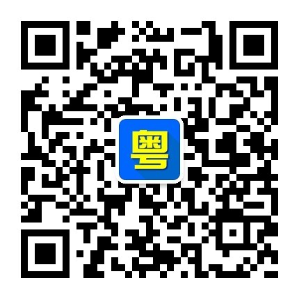
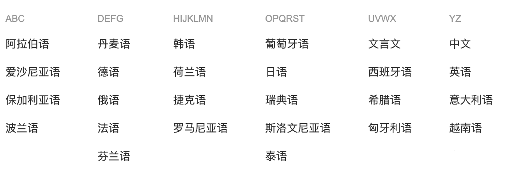

# CoolCantonese WeChat Official Account Project

[中文](./README.md)

In order to help my friends to learn Cantonese, I develop this WeChat official account which provide text translation from many other languages to Cantonese and voice translation from Mandarin to Cantonese. You can use WeChat to scan the fellow QR code to subscribe the official account.

Support languages:

## Development

### Configuration

Refer to `coolcantonese/conf` directory `config.json.example`
If you use Docker to deploy, please refer to `.env.example`

### Deployment

Recommend to deploy using docker-compose.
After configed, just run `docker-compose up`.

### Test

You can use [ushuz/weixin-simulator](https://github.com/ushuz/weixin-simulator) for WeChat simulate test

### Credits

1. [Ekho](http://www.eguidedog.net/cn/ekho_cn.php) Text To Speech (TTS) software supports Cantonese, Mandarin
2. [whtsky/WeRoBot](https://github.com/whtsky/WeRoBot) Python WeChat robot framework

## Looking for heep from frontend developers

I want to develop a WeChat mini program and an offical webside for this project, but due to my limited
frontend skills and time I can spend on this project I am now looking for help from frontend developers.
If you are a frontend developer who interested in this project, please contact me through email.